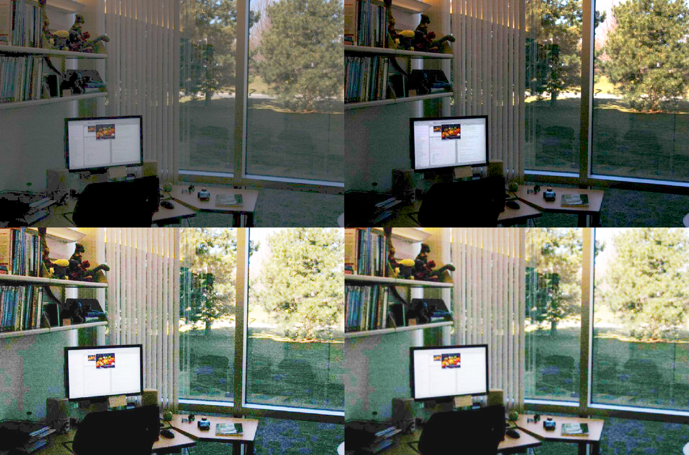

# Lab 3 - Intensity Transformation and Spatial Filtering 
*_Zachary Berry 30th Jan 2024_*


## Task 1: Contrast enhancement with *_imadjust_* 


### Viewing rows and columns  

The result of intensity of pixel at *_f(3,10)_* was a *_uint8_* with value *_28_*. *_N.B. 
this doesn't actually display top half of the image, as it has a pixel
height of 571._*

```
imfinfo('assets/breastXray.tif')
f = imread('assets/breastXray.tif');
imshow(f)
f(3,10)            
imshow(f(1:241,:))
```
<p align="center">  </p>

<p align="center">  </p>


Using this code, we can display only the right half of the image. 

```
imshow(f(:,1:241))
```
<p align="center">  </p>


The *_fmin_* and *_fmax_* in this image is close to the full range, which would be
*_min = 0_*, and *_max = 255_*. In this case, *_fmin = 21_*, and *_fmax = 255_*. 

```
[fmin, fmax] = bounds(f(:))
```
<p align="center">  </p>

### Negative images

Using this *_imadjust_* we can see both the regular and negative images in a montage. We found that when using *_imshowpair_* and montaging the 2 images, Matlab automatically normalises the two images to make them easier to compare. By using *_Scaling_* and *_none_*, we can remove this normalisation for the graysccale values of *_f_* are preverved. 

```
g1 = imadjust(f, [0 1], [1 0])
figure                          % open a new figure window
imshowpair(f, g1, 'montage')
imshowpair(f, g1, 'montage', 'Scaling','none')
```
<p align="center">  </p>

Below left is the normalized image in the montage and below right is the unnormalized, you can see visibly the difference in darkness. 

<p align="center">  </p>


### Gamma correction 

```
g2 = imadjust(f, [0.5 0.75], [0 1]);
g3 = imadjust(f, [ ], [ ], 2);
figure
montage({g2,g3})
```
<p align="center">  </p>

## Task 2: Contrast stretching function 

In the contrast stretching function, "E" defines the gradient of the function. As a result, if it is negative, the pixel values are flipped and we see a negative of the original image. 

```
f = imread('assets/bonescan-front.tif');
r = double(f);  % uint8 to double conversion
k = mean2(r);   % find mean intensity of image
E = -5.9;
s = 1 ./ (1.0 + (k ./ (r + eps)) .^ E);
g = uint8(255*s);
imshowpair(f, g, "montage")
```

<p align="center">  </p>


## Task 3: Contrast enhancement using histogram


After using *_imadjust_*, we the second histogram shows the pixel values of g to be between roughly 60 and 240, which is more spread out than the first one. 


```
f=imread('assets/pollen.tif');
imshow(f)
figure          
imhist(f);      
```

```
g=imadjust(f,[0.3 0.55]);
montage({f, g})     
figure
imhist(g);
```

<p align="center">  </p>


### Histogram, PDF and CDF

Here, when plotting a PDF and CDF of the original image, *_subplot_* defines the amount of plots I can create at the same time. Using *_subplot_* with *_(1,3,1)_* allows me to plot the subplo*_1x3 suplots_*. 

```
g_pdf = imhist(g) ./ numel(g);
g_cdf = cumsum(g_pdf);       
close all                    
imshow(g);
subplot(1,2,1)             
plot(g_pdf)
subplot(1,2,2)                 
plot(g_cdf)
```

<p align="center">  </p>


### Histogram equalization 

After applying the *_histeq_* function, we see a flattened histogram of the image, which provides the best range of pixel intensities and therefore the best looking image. 
Unfortunately *_close all_* is crashing my mac on m3 silicon, don't think matlab is sufficiently compiled.

```
x = linspace(0, 1, 256);   
figure
plot(x, g_cdf)
axis([0 1 0 1])             
set(gca, 'xtick', 0:0.2:1)  
set(gca, 'ytick', 0:0.2:1)
xlabel('Input intensity values', 'fontsize', 9)
ylabel('Output intensity values', 'fontsize', 9)
title('Transformation function', 'fontsize', 12)
h = histeq(g,256);          
montage({f, g, h})
figure;
subplot(1,3,1); imhist(f);
subplot(1,3,2); imhist(g);
subplot(1,3,3); imhist(h);
```
<p align="center">  </p>

<p align="center">  </p>

## Task 4: Noise reduction with lowpass filter

The larger the kernel size, the greater the amount of blur, and the less noisy the image. However, when decreasing noise, there is always a tradeoff in the amount of sharpness. Adjusting the sigma value in the gaussian kernel defines the steepness of the gaussian - so the larger the sigma value the smaller the steepness and the resulting image is less blurred.
```
f = imread('noisyPCB.jpg');
imshow(f)
w_box = fspecial('average', [9 9])
w_gauss = fspecial('Gaussian', [7 7], 1.0)
w_sobel = fspecial('sobel')
g_box = imfilter(f, w_box, 20);
g_gauss = imfilter(f, w_gauss, 20);
g_sobel = imfilter(f, w_sobel, 20); 
figure
montage({f, g_box, g_gauss, g_sobel})
```
<p align="center">  </p>


## Task 5: Median filtering

When using *_medfilt2_*, sharpness is definitely better with smaller kernel dimensions, but going larger there is still a reduction in sharpness. Additionally, changing from *_zeros_* to *_indexed_* gives a small black border around the new image. 

```
g_median = medfilt2(f, [7 7], 'zero');
figure; montage({f, g_median})
```

<p align="center">  </p>


## Task 6: Laplacian, sobel and unsharp filters 

After testing *_sobel, laplacian_* and *_unsharp_* filters on the moon image, the *_unsharp_* filter, which ironically is Matlab's sharpening filter, seemed to provide the clearest image of the craters. 

```
f = imread('moon.tif');
w_sobel = fspecial('sobel')
w_laplacian = fspecial('laplacian')
w_unsharp = fspecial('unsharp') 
g_sobel = imfilter(f, w_sobel); 
g_laplacian = imfilter(f, w_laplacian); 
g_unsharp = imfilter(f, w_unsharp); 
montage({f, g_sobel, g_laplacian, g_unsharp}, "size", [2 2])
```

<p align="center">  </p>


## Task 7: Additional challenges

### Challenge 1 

This code uses *_histeq_* to create a flattened histogram of the original image, and then *_unsharp_* to sharpen the image slightly. 

```
f = imread('assets/lake&tree.png');
h = histeq(f,256); 
w_unsharp = fspecial('unsharp') 
g_unsharp = imfilter(h, w_unsharp); 
montage({f, h, g_unsharp})
```

<p align="center">  </p>


### Challenge 2 

In this code, I first use *_imadjust_* to increase the brightness of the original image. I then use a *_laplacian_* filter to highlight the outlines of the circles. Then, I apply a *_gaussian_* filter to the result to try and reduce some of the noise of the wood grain - unfortunately this didn't work that well. Finally, I used *_imadjust_* again to increase the brightness so the circles can be seen better. 

```
c = imread('assets/circles.tif'); 
g2 = imadjust(c, [0.5 0.7], [0 1])
w_sobel = fspecial('sobel') 
w_laplacian = fspecial('laplacian') 
w_gauss = fspecial('Gaussian', [2 2], 1.0)
g_sobel = imfilter(g2, w_laplacian); 
g_gauss = imfilter(g_sobel, w_gauss, 20);
g3 = imadjust(g_gauss, [0 0.1], [0 1])
montage({c, g2, g_sobel, g_gauss, g3})
```

<p align="center">  </p>


### Challenge 3 

For this final challenge, I first used *_histeq_*, which, reading up on the Matlab documentation, applies histogram equalization to the luminance channel, before converting it back in to an RBG image. The result of this is the image appears brighter and more saturated. I them use *_gaussian_* and *_unsharp_* filters in series to try and improve the sharpness of the image. 

```
f = imread('office.jpg');
f_eq = histeq(f, 256);
w_gauss = fspecial('gaussian', [5 5], 1.0);
f_gauss = imfilter(f_eq, w_gauss, 'replicate');
w_unsharp = fspecial('unsharp');
f_sharp = imfilter(f_gauss, w_unsharp, 'replicate');
montage({f, f_eq, f_gauss, f_sharp}, 'Size', [2 2]);
```

<p align="center">  </p>


   